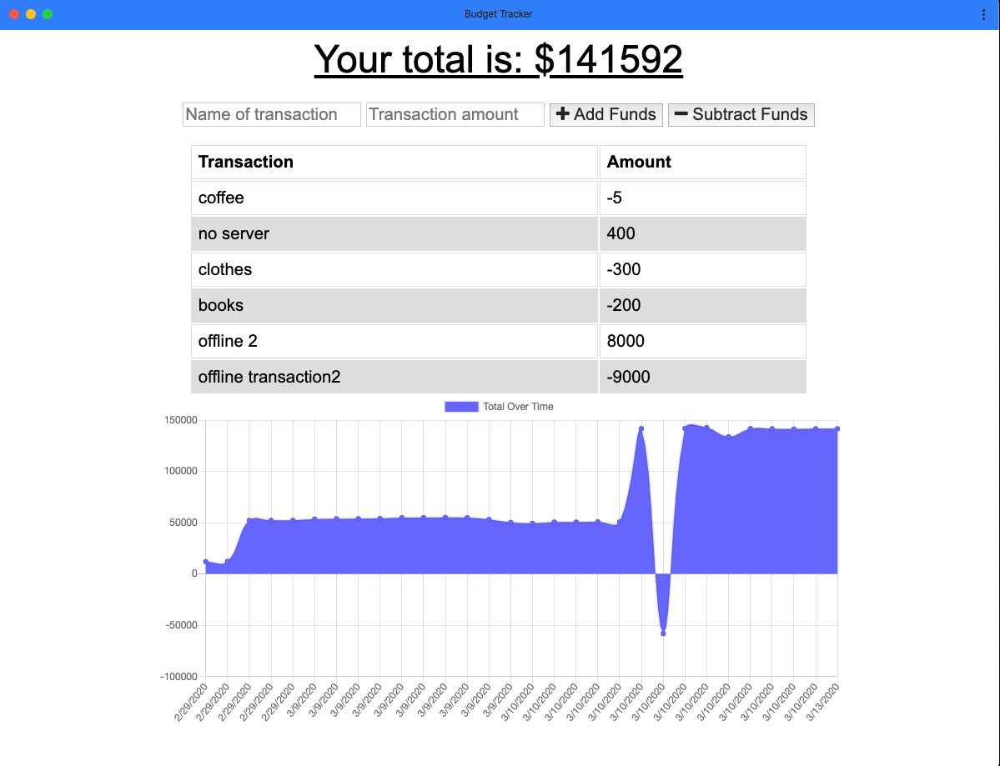

# Budget-Tracker

Budget Tracker application to allow for offline access and functionality. The user will be able to add expenses and deposits to their budget with or without a connection. When entering transactions offline, they should populate the total when brought back online. Offline Functionality: Enter deposits offline Enter expenses offline When brought back online: Offline entries should be added to tracker.

## Tech Used / Dependencies

- PWA
- Express
  *Node.js
  *Mongo/mongoose
  \*Service worker
